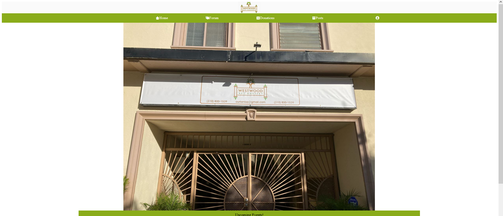
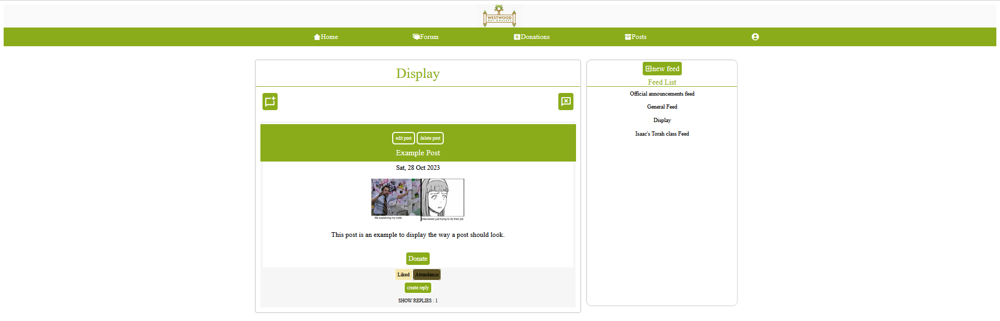
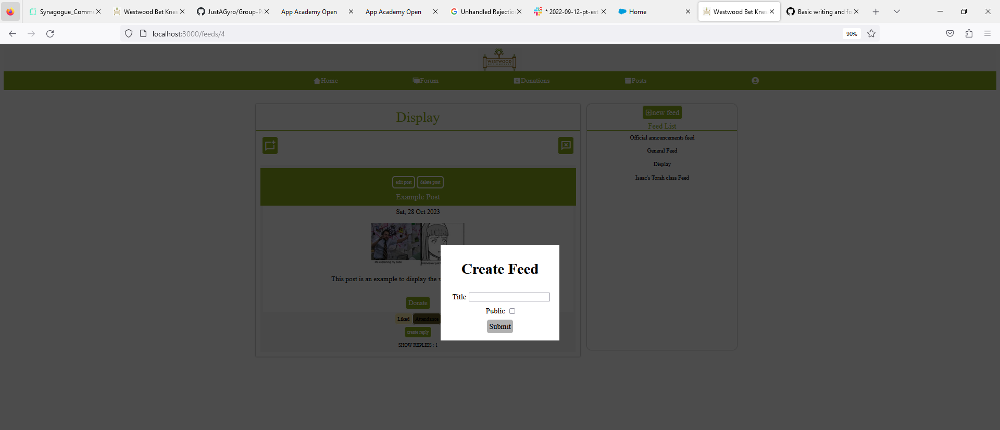
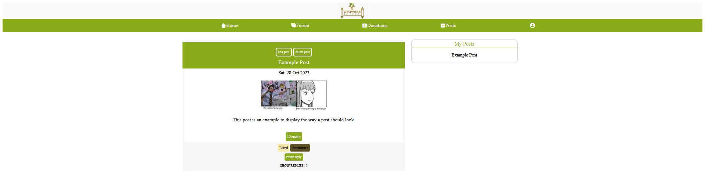
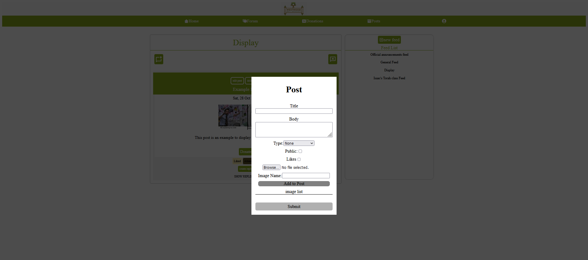
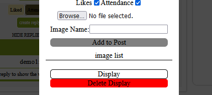
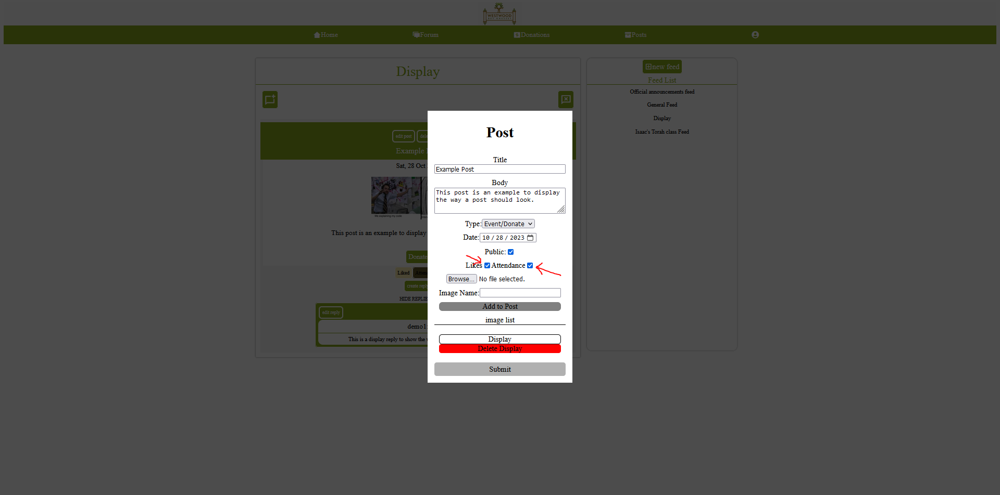
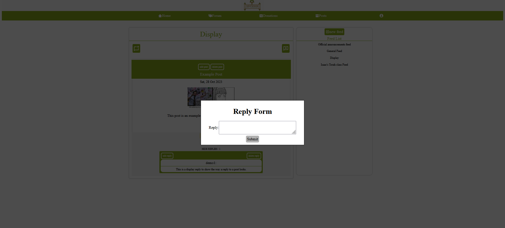
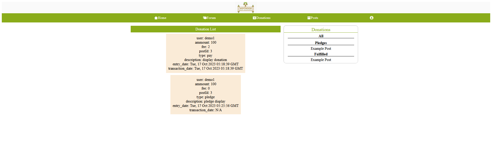
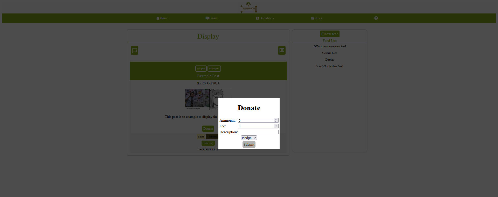

# Synnagogue Forum
## Summary
This project is a forum for my local community designed to empower users to communicate, plan events, as well as raise funds for said events.

## Table of Contents

- [Installation](#installation)
- [Usage](#usage)

## Installation

To get started, follow these steps:

1. **Clone or fork the project.**
2. **Run 'pipenv install' in the root directory to install server dependecies.**
3. **Run 'npm install' to install frontend dependencies.**
4. **Run 'pipenv run flask db migrate' and 'pipenv run flask seed all' to add the mock data.**
5. **Run 'pipenv run flask run' in the root depsoitory.**
6. **Run 'npm start' in the react-app folder.**
7. Create environment variables for SECRET_KEY, DATABASE_URL, SCHEMA, ACCESS_KEY, SECRET_ACCESS_KEY, BUCKET_NAME,AWS_REGION
BUCKET_URL. Note that this project makes use of an AWS bucket and this will need to be set up for full use of images. Explaining this step is outside the scope of these instructions.
## Usage

### Feeds

1. **Logged in Users can create Feeds**
2. **Logged in Users can view Feeds**
3. **Logged in Users can delete Feeds they have created**

### Posts

1. **Logged in Users can create Posts**
2. **Logged in Users can view Posts**
3. **Logged in Users can edit Posts they have created**
4. **Logged in Users can delete Posts they have created**

### PostImages

1. **Logged in Users can create PostImages in the Post form**
2. **Logged in Users can view PostImages in the Post display**
3. **Logged in Users can delete PostImages in the Post form**

### PostTags

1. **Logged in Users can create PostTags in the Post form by clicking on the like or attendance checkbox**
2. **Logged in Users can view PostTags in the Post display**
3. **Logged in Users can delete PostTags in the Post form**
- Note that at this time, PostTags are limited to Likes and Attendance

### Tags

1. **Logged in Users can create Tags by clicking on the associated button on a Post with an associated PostTag**
2. **Logged in Users can view if a Tag is associated with their account by viewing the associated Post**
3. **Logged in Users can delete a Tag for a given Post by clicking on the associated button on a Post**

### Replies

1. **Logged in Users can create Replies**
2. **Logged in Users can view Replies**
3. **Logged in Users can edit Replies they have created**
4. **Logged in Users can delete Replies they have created**

### Donations

1. **Logged in Users can create Donations**
2. **Logged in Users can view Donations they have created**
